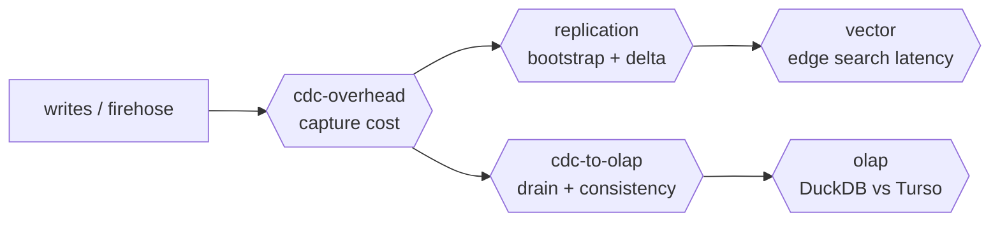
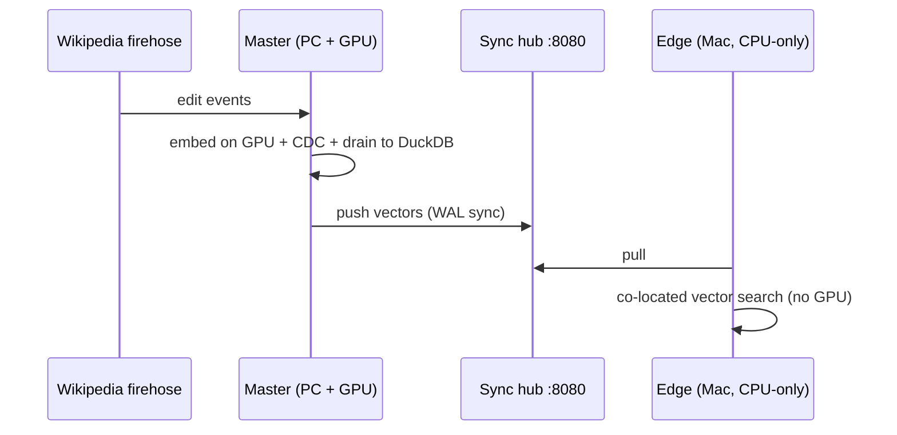

# cascade

**An experimental, open, *runnable* guide to replacing heavy data infrastructure with
[Turso](https://github.com/tursodatabase/turso) (the Rust rewrite of SQLite).**

One embedded engine that does edge OLTP **+ CDC + native replication + a vector store** — instead of
stitching together Postgres + pgvector + Debezium + Kafka + Pinecone + Litestream. It's both a
**library** you drop into your own code and a **config-driven CLI** (`cascade`) for standing up
master/replica nodes — plus a hands-on harness where every claim is a command that emits a number.

### Start here

1. **Prove it locally in one command** — `./setup.sh && ./test.sh` runs the post-build gate: config
   contract → health → master role → replica role, a full master→hub→replica round-trip on one
   machine (ingest → CDC→OLAP → sync → vector search). Exits non-zero on any failure. Only needs the
   bundled `tursodb` CLI + Ollama (`ollama pull all-minilm`).
2. **Read [`PATTERNS.md`](PATTERNS.md)** — the 5 patterns, each with *what heavy stack it replaces*,
   *how to run it*, and *the metric that proves the win*.
3. **Run the two-machine lab** — [`LAB.md`](LAB.md): a GPU producer embeds a live firehose and fans
   vectors out to CPU-only edge replicas that do RAG.
4. **Contribute** — [`CONTRIBUTING.md`](CONTRIBUTING.md): add a pattern, a competitor comparison, or a
   data source.

| Pattern | Replaces |
|---|---|
| Self-replicating edge OLTP | Postgres read-replicas + Litestream |
| CDC without a broker | Debezium + Kafka |
| Co-located vector search | Pinecone / Weaviate / pgvector service |
| AI distribution (embed once, fan out) | per-node embedding infra / hosted embedding APIs |
| Lakehouse source | a bespoke Iceberg ingestion pipeline |

### Use it — config-driven CLI

```bash
cascade init configs/master.toml                 # scaffold a master config (--replica for a replica)
cascade serve  --config configs/master.toml      # master: spawn sync hub + ingest + CDC + push
cascade search "your question" --config configs/replica.toml   # replica: pull + co-located vector search
cascade drain  --config configs/master.toml      # master: drain the CDC stream -> DuckDB (OLAP lane)
```

One TOML file describes a node — role (`master`/`replica`), db path, sync remote, CDC, embedding
model/dim, OLAP target, and a built-in `source` (`wikimedia` | `hn` | `demo` | `none`). See
[`configs/`](configs/).

### Use it — Rust library

```toml
# Cargo.toml
cascade = { git = "https://github.com/javaids33/turso-edge-olap" }
```
```rust
use cascade::{Config, Node};
use serde_json::json;

let node = Node::open(Config::from_path("node.toml")?).await?;
node.put("doc-1", "Turso replaces a CDC + vector stack", &json!({"src":"demo"})).await?;
node.push().await?;                       // replicate to edges
let hits = node.search("what does turso replace?", 5).await?;   // co-located vector search
```
Run the smallest end-to-end library demo: `cargo run --example library_local` (needs Ollama).

### Use it — from any language (HTTP gateway)

Run a gateway co-located with a node, then drive it over HTTP from Python / JS / Go (an edge's app
still gets local vector search):

```bash
cascade gateway --config configs/replica.toml         # GET /health · POST /put · GET /search · POST /drain
```
Thin clients (~40 lines each, no deps) in [`clients/`](clients/). For the two-machine network/health
runbook (LAN preflight, CDC + push-down checks), see [`TEST.md`](TEST.md).

### Tested use cases

- **Living Knowledge Base** (live edge RAG) — [`LAB.md`](LAB.md): the `wikimedia` source + two-machine
  master/replica. Validated end-to-end (incl. one producer → many edges).
- **Performance benchmark** — `cascade run-all`: CDC overhead, replication, OLAP lane, vector latency on
  synthetic data → `docs/REPORT.md`.

---

A reproducible benchmark harness for the core pattern — implemented natively in **Rust** (the
`turso`, `duckdb`, and `iceberg` crates; no Python):

```
  ┌─────────────────────┐   native sync   ┌──────────────────────┐
  │  Primary "master"   │ ──────────────▶ │  Replica "slave"     │  edge reads +
  │  Turso (OLTP)       │  (WAL pages)    │  Turso (edge)        │  vector search
  │  + CDC capture      │                 └──────────────────────┘
  └─────────┬───────────┘
            │ turso_cdc (change_id cursor, decoded to JSON)
            ▼
  ┌─────────────────────┐
  │ CDC → OLAP loader   │ ──▶  DuckDB  +  Apache Iceberg   ──▶  analytics
  └─────────────────────┘
```

The thesis: **Turso isn't an analytics engine — it's a clean *source* into one.** Edge OLTP +
built-in CDC + native replication + co-located vectors, with DuckDB/Iceberg doing the heavy
analytical lifting.

## Quickstart (macOS or Linux/WSL)

```bash
./setup.sh                 # downloads the matching tursodb CLI, then `cargo build --release`
./run.sh                   # synthetic data → full pipeline + benchmarks → docs/REPORT.md
```

No external dataset required — `run.sh` generates synthetic patents data by default. To
reproduce the headline numbers on real data:

```bash
PATENTS_JSONL=/path/to/patents.jsonl ./run.sh
```

Results land in `results/*.json`; a written report is generated at `docs/REPORT.md`.

## What it measures

The harness is a single binary, `cascade`, with one subcommand per phase
(`./target/release/cascade --help`). `run-all` (via `./run.sh`) chains them and spawns the sync
server for the replication phase.

| Phase | `cascade` subcommand | Measures |
|---|---|---|
| 1 | `gen-synthetic` / `prep-data` | build patents/cpc/citations Parquet |
| 2 | `replication` | master→replica throughput, sync lag, bytes |
| 3a | `cdc-overhead` | CDC capture cost (throughput + storage) |
| 3b | `cdc-to-olap` | drain `turso_cdc` → DuckDB + Iceberg |
| 4 | `olap` | analytical queries: DuckDB vs Turso (lane comparison) |
| 5 | `vector` | edge `vector_distance_cos` latency vs row count |
| 6 | `report` | synthesize `results/*.json` → `docs/REPORT.md` |

## Headline results (real data: 171,317 energy-storage patents)

- **CDC overhead:** ~17–24% write-throughput cost, ~2× storage (`full` mode, before+after images).
- **CDC → OLAP:** tens of thousands of changes/s into DuckDB + a real Iceberg table, sinks verified consistent.
- **Replication:** sub-second replica bootstrap; ~10–40ms incremental catch-up via page-level WAL sync.
- **OLAP lane gap:** DuckDB beats Turso by 10–200× on aggregations/joins (expected — columnar vs row).
- **Edge vector search:** works today, but **linear-scan (no ANN index)** — latency grows ~linearly.

See [`docs/REPORT.md`](docs/REPORT.md) for the full writeup, and [`CLAUDE.md`](CLAUDE.md) for
setup internals / known gaps.

## Benchmarks — what we tested, why, and what it proves

Two kinds of evidence: the **harness** (one command per phase) and a **live two-machine run** (a
Windows + GPU master and a CPU-only Mac edge). The numbers below are *measured this run* on a dev box
(synthetic 20k rows, WSL2 on NTFS — i.e. **conservative**; native Linux/ext4 is faster). The
real-data headline above (171k patents) shows lower CDC overhead because cost amortizes with scale.
Reproduce everything with `./run.sh`.

Each benchmark targets one stage of the pipeline:



| Benchmark | What it tests | Why it matters | Measured (this run) | Use case it validates |
|---|---|---|---|---|
| **cdc-overhead** | write throughput + storage, CDC off vs on | is built-in CDC cheap enough to leave on always? | 98k → 56k inserts/s (**~43%** cost), **2.0×** storage | CDC without a broker (vs Debezium + Kafka) |
| **replication** | bootstrap + incremental sync throughput/bytes | can an edge join fast and stay fresh cheaply? | bootstrap **18k rows in 1.2s / 12.4MB**; delta **2k rows in 0.3s / 1.4MB**; converged | self-replicating edge OLTP (vs Postgres replicas + Litestream) |
| **vector** | `vector_distance_cos` latency vs rows (NN accuracy checked) | is co-located search fast at edge scale? | **0.4ms@1k → 9.6ms@20k** (linear), nearest-neighbor correct | co-located vector search (vs Pinecone / pgvector) |
| **cdc-to-olap** | drain `turso_cdc` → DuckDB + Iceberg + consistency | is the analytics feed correct and quick? | 20k changes @ **519/s**, `duckdb == iceberg == source` | lakehouse source (vs bespoke Iceberg ETL) |
| **olap** | analytical queries: DuckDB vs Turso | why drain at all instead of querying OLTP? | DuckDB **3.5× – 155×** faster | the OLAP-lane separation itself |

### Live two-machine run — the AI-distribution pattern

A GPU producer embeds once; CPU-only edges pull finished vectors and search locally:



The master embedded and pushed **13,728 docs with 0 push failures**, auto-recovering from live
firehose drops. The Mac edge bootstrapped to an exact **13,728 docs == 13,728 vectors (0 orphans)**
and answered queries at **p50 58 ms / p95 72 ms** warm (20 back-to-back) on an **Apple M3 MacBook
Air, CPU-only — no GPU** — having embedded none of the corpus itself. That latency *includes* the
query-embedding round-trip to local Ollama; the pure SQL scan over 13,728 × 384-dim vectors is
single-digit ms.

### What this achieves
- **Four services collapse into one binary:** OLTP + CDC + replication + vectors + an OLAP feed — no
  Kafka, Debezium, Pinecone, or Litestream.
- **Embed once, search everywhere:** the expensive GPU work happens on a single node; every CPU edge
  gets millisecond-scale local search.
- **Correct and verified, not just fast:** replication converged, OLAP sinks consistent
  (`duckdb == iceberg == source`), edge **1:1 docs↔vectors** confirmed across two machines.

### Honest limits
- Vectors are **linear-scan (no ANN index)** — great to tens of thousands of rows per edge, not
  billion-scale.
- Sync is **one-way (master → replica)** — read replicas, no multi-primary / write-back.
- Turso is **beta**; under churn we hit a transient `F32_BLOB` push quirk (self-healed, 0 net
  failures). No competitor pipeline was stood up — comparisons are conceptual plus our numbers.

## Live lab: "Living Knowledge Base" (distributed edge RAG)

Beyond the synthetic benchmark, [`LAB.md`](LAB.md) is a two-machine lab that exercises every Turso
capability at once on a **live** stream: a **master** ingests the Wikimedia firehose, embeds each
edit on a GPU (Ollama), and writes to Turso with **CDC** on; that feeds a **DuckDB OLAP** lane *and*
replicates over **native sync** to an **edge** that answers questions with **co-located vector
search** + a local LLM — no separate vector DB. New `cascade` subcommands: `ingest` (master), `rag`
(edge), `lab-olap` (CDC→DuckDB trends). Transport is just `TURSO_REMOTE_URL` (Tailscale/LAN). See
[`LAB.md`](LAB.md) and [`docker/`](docker/).

## Requirements

- macOS (arm64/x86_64) or Linux/WSL2 (x86_64/aarch64). **Windows native is unsupported** — the
  prebuilt `tursodb` sync-server CLI targets macOS/Linux and its async `io_uring` path is
  Linux-only; use WSL2.
- **Rust toolchain ≥ 1.92** (`cargo`), `bash`, `curl`, `tar` with `.xz` support, `git`. The
  DuckDB engine is built bundled (no system DuckDB needed); first `cargo build` is a few minutes.

## Configuration (env vars)

| Var | Default | Purpose |
|---|---|---|
| `TURSO_EXP_HOME` | `<repo>/.work` | runtime data/db/out dir |
| `TEO_REPO_ROOT` | _(cwd)_ | repo root override (set automatically by `run.sh`) |
| `PATENTS_JSONL` | _(unset)_ | real source data; unset → synthetic |
| `SYNTH_N` | `50000` | synthetic patent count |
| `TURSO_REMOTE_URL` | `http://127.0.0.1:8080` | sync server URL (port is parsed from here) |
| `TURSODB` | _(auto)_ | path to the `tursodb` CLI (else found under `.work/bin`) |
| `TURSO_VERSION` | `v0.6.1` | tursodb CLI release (keep in lockstep with the `turso` crate in `Cargo.toml`) |

## License / status

Experiment / evaluation harness. Turso itself is BETA — see caveats in `docs/REPORT.md`.
