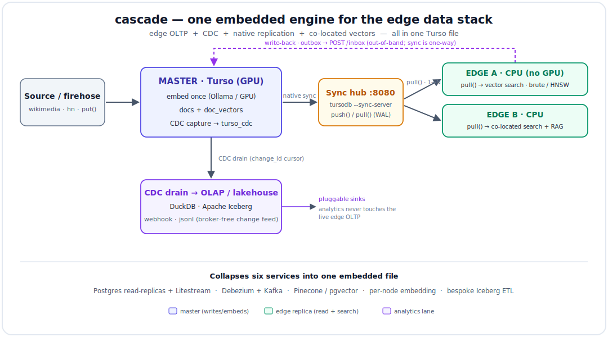
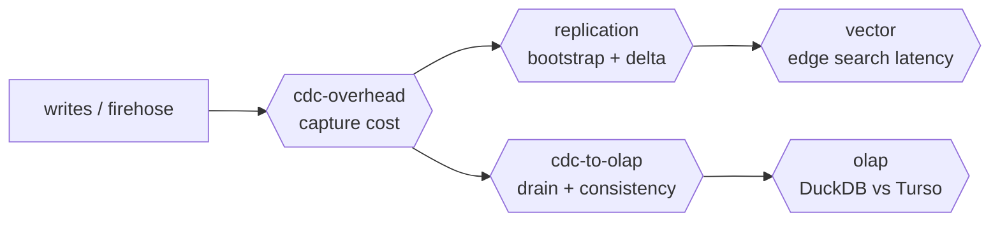
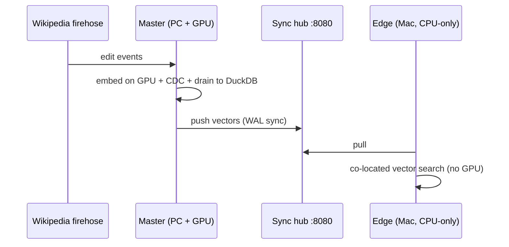

# cascade

**An experimental, open, *runnable* guide to replacing heavy data infrastructure with
[Turso](https://github.com/tursodatabase/turso) (the Rust rewrite of SQLite).**

One embedded engine that does edge OLTP **+ CDC + native replication + a vector store** — instead of
stitching together Postgres + pgvector + Debezium + Kafka + Pinecone + Litestream. It's both a
**library** you drop into your own code and a **config-driven CLI** (`cascade`) for standing up
master/replica nodes — plus a hands-on harness where every claim is a command that emits a number.

### Start here

1. **Prove it locally in one command** — `./setup.sh && ./test.sh` runs the post-build gate: config
   contract → health → master role → replica role, a full master→hub→replica round-trip on one
   machine (ingest → CDC→OLAP → sync → vector search). Exits non-zero on any failure. Only needs the
   bundled `tursodb` CLI + Ollama (`ollama pull all-minilm`).
2. **Read [`PATTERNS.md`](PATTERNS.md)** — the 5 patterns, each with *what heavy stack it replaces*,
   *how to run it*, and *the metric that proves the win*.
3. **Run the two-machine lab** — [`LAB.md`](LAB.md): a GPU producer embeds a live firehose and fans
   vectors out to CPU-only edge replicas that do RAG.
4. **Contribute** — [`CONTRIBUTING.md`](CONTRIBUTING.md): add a pattern, a competitor comparison, or a
   data source.

| Pattern | Replaces |
|---|---|
| Self-replicating edge OLTP | Postgres read-replicas + Litestream |
| CDC without a broker | Debezium + Kafka |
| Co-located vector search | Pinecone / Weaviate / pgvector service |
| AI distribution (embed once, fan out) | per-node embedding infra / hosted embedding APIs |
| Lakehouse source | a bespoke Iceberg ingestion pipeline |

### Use it — config-driven CLI

```bash
cascade init configs/master.toml                 # scaffold a master config (--replica for a replica)
cascade serve  --config configs/master.toml      # master: spawn sync hub + ingest + CDC + push
cascade search "your question" --config configs/replica.toml   # replica: pull + co-located vector search
cascade drain  --config configs/master.toml      # master: drain the CDC stream -> DuckDB (OLAP lane)
```

One TOML file describes a node — role (`master`/`replica`), db path, sync remote, CDC, embedding
model/dim, OLAP target, and a built-in `source` (`wikimedia` | `hn` | `demo` | `none`). See
[`configs/`](configs/).

### Use it — Rust library

```toml
# Cargo.toml
cascade = { git = "https://github.com/javaids33/cascade" }
```
```rust
use cascade::{Config, Node};
use serde_json::json;

let node = Node::open(Config::from_path("node.toml")?).await?;
node.put("doc-1", "Turso replaces a CDC + vector stack", &json!({"src":"demo"})).await?;
node.push().await?;                       // replicate to edges
let hits = node.search("what does turso replace?", 5).await?;   // co-located vector search
```
Run the smallest end-to-end library demo: `cargo run --example library_local` (needs Ollama).

### Use it — from any language (HTTP gateway)

Run a gateway co-located with a node, then drive it over HTTP from Python / JS / Go (an edge's app
still gets local vector search):

```bash
cascade gateway --config configs/replica.toml         # GET /health · POST /put · GET /search · POST /drain
```
Thin clients (~40 lines each, no deps) in [`clients/`](clients/). For the two-machine network/health
runbook (LAN preflight, CDC + push-down checks), see [`TEST.md`](TEST.md).

### Tested use cases

- **Living Knowledge Base** (live edge RAG) — [`LAB.md`](LAB.md): the `wikimedia` source + two-machine
  master/replica. Validated end-to-end (incl. one producer → many edges).
- **Performance benchmark** — `cascade run-all`: CDC overhead, replication, OLAP lane, vector latency on
  synthetic data → `docs/REPORT.md`.

---

A reproducible benchmark harness for the core pattern — implemented natively in **Rust** (the
`turso`, `duckdb`, and `iceberg` crates; no Python):

<p align="center">
  
</p>

The thesis: **Turso isn't an analytics engine — it's a clean *source* into one.** Edge OLTP +
built-in CDC + native replication + co-located vectors, with DuckDB/Iceberg doing the heavy
analytical lifting.

## Quickstart (macOS or Linux/WSL)

```bash
./setup.sh                 # downloads the matching tursodb CLI, then `cargo build --release`
./run.sh                   # synthetic data → full pipeline + benchmarks → docs/REPORT.md
```

No external dataset required — `run.sh` generates synthetic patents data by default. To run the
same harness on your own data:

```bash
PATENTS_JSONL=/path/to/patents.jsonl ./run.sh
```

Results land in `results/*.json` (committed) and roll up into `docs/REPORT.md`. `run-all` also
archives a self-consistent copy under `results/<run-id>/` so a later run can't clobber a baseline
you cited.

## What it measures

The harness is a single binary, `cascade`, with one subcommand per phase
(`./target/release/cascade --help`). `run-all` (via `./run.sh`) chains them and spawns the sync
server for the replication phase.

| Phase | `cascade` subcommand | Measures |
|---|---|---|
| 1 | `gen-synthetic` / `prep-data` | build patents/cpc/citations Parquet |
| 2 | `replication` | master→replica throughput, sync lag, bytes |
| 3a | `cdc-overhead` | CDC capture cost (throughput + storage) |
| 3b | `cdc-to-olap` | drain `turso_cdc` → DuckDB + Iceberg |
| 4 | `olap` | analytical queries: DuckDB vs Turso (lane comparison) |
| 5 | `vector` | edge `vector_distance_cos` latency vs row count (+ HNSW `ann` block) |
| 6 | `report` | synthesize `results/*.json` → `docs/REPORT.md` |

Outside `run-all`: `cascade compare-cdc` (competitor comparison — built-in CDC vs the hand-rolled
SQLite trigger pattern), `cascade prune` (bound the CDC log), `cascade enqueue`/`flush` (edge
write-back). Cross-engine harness (Postgres+Debezium, SQLite+Litestream) lives in [`docker/compare/`](docker/compare/).

## Headline results

The numbers below are the **committed `results/*.json`** from one `./run.sh` on synthetic data
(50k rows; replication phase uses 18k + a 2k delta). They regenerate exactly with `./run.sh` and
roll up into [`docs/REPORT.md`](docs/REPORT.md).

- **CDC overhead:** **43.7%** write-throughput cost (307k → 173k inserts/s) and **2.01×** storage —
  `full` mode, 50,012 change records captured for 50,000 inserts.
- **CDC → OLAP:** 50,000 changes drained into DuckDB + a real Iceberg table at **~4,851 changes/s**;
  `duckdb == iceberg == source` (consistent).
- **Replication:** 18k-row replica bootstrap in **1.21s** (11.8 MB); 2k-row delta in **0.30s**
  (1.4 MB); converged.
- **OLAP lane gap:** DuckDB beats Turso by **2.5× – 189×** on aggregations/joins (expected — columnar
  vs row), which is *why* you drain.
- **Edge vector search:** Turso brute-force **0.23 ms @ 1k → 14.2 ms @ 50k** (linear, dim 64),
  nearest-neighbor correct; an in-memory **HNSW** index (`hnsw_rs`) is also measured (recall@10 +
  latency) to push past the linear ceiling.

See [`CLAUDE.md`](CLAUDE.md) for setup internals / known gaps.

## Benchmarks — what we tested, why, and what it proves

Two kinds of evidence: the **harness** (one command per phase, numbers committed in `results/`) and a
**live two-machine run** (a Windows + GPU master and a CPU-only Mac edge, reported separately below).
The harness table is the committed synthetic run (50k rows; replication 18k + 2k delta) — every cell
traces to a `results/*.json` field and regenerates with `./run.sh`.

Each benchmark targets one stage of the pipeline:



| Benchmark | What it tests | Why it matters | Measured (committed `results/`) | Use case it validates |
|---|---|---|---|---|
| **cdc-overhead** | write throughput + storage, CDC off vs on | is built-in CDC cheap enough to leave on always? | 307k → 173k inserts/s (**43.7%** cost), **2.01×** storage (50k rows, 50,012 changes) | CDC without a broker (vs Debezium + Kafka) |
| **replication** | bootstrap + incremental sync throughput/bytes | can an edge join fast and stay fresh cheaply? | bootstrap **18k rows in 1.21s / 11.8MB**; delta **2k rows in 0.30s / 1.4MB**; converged | self-replicating edge OLTP (vs Postgres replicas + Litestream) |
| **vector** | `vector_distance_cos` latency vs rows (NN accuracy checked) | is co-located search fast at edge scale? | **0.23ms@1k → 14.2ms@50k** (brute, linear), nearest-neighbor correct; HNSW `ann` block | co-located vector search (vs Pinecone / pgvector) |
| **cdc-to-olap** | drain `turso_cdc` → DuckDB + Iceberg + consistency | is the analytics feed correct and quick? | 50k changes @ **4,851/s**, `duckdb == iceberg == source` | lakehouse source (vs bespoke Iceberg ETL) |
| **olap** | analytical queries: DuckDB vs Turso | why drain at all instead of querying OLTP? | DuckDB **2.5× – 189×** faster (3.1M rows loaded) | the OLAP-lane separation itself |

### Live two-machine run — the AI-distribution pattern

> Observed on a real two-machine run (Windows+GPU master, Apple M3 CPU edge) — reported here for
> context; these figures are **not** in the committed `results/` (that's the synthetic harness above).

A GPU producer embeds once; CPU-only edges pull finished vectors and search locally:



The master embedded and pushed **13,728 docs with 0 push failures**, auto-recovering from live
firehose drops. The Mac edge bootstrapped to an exact **13,728 docs == 13,728 vectors (0 orphans)**
and answered queries at **p50 58 ms / p95 72 ms** warm (20 back-to-back) on an **Apple M3 MacBook
Air, CPU-only — no GPU** — having embedded none of the corpus itself. That latency *includes* the
query-embedding round-trip to local Ollama; the pure SQL scan over 13,728 × 384-dim vectors is
single-digit ms.

### What this achieves
- **Four services collapse into one binary:** OLTP + CDC + replication + vectors + an OLAP feed — no
  Kafka, Debezium, Pinecone, or Litestream.
- **Embed once, search everywhere:** the expensive GPU work happens on a single node; every CPU edge
  gets millisecond-scale local search.
- **Correct and verified, not just fast:** replication converged, OLAP sinks consistent
  (`duckdb == iceberg == source`), edge **1:1 docs↔vectors** confirmed across two machines.

### Honest limits
- Turso's own vector search is **linear-scan (no ANN index)** — great to tens of thousands of rows
  per edge. To go further, `cascade vector` now also builds an in-memory **HNSW** index (`hnsw_rs`)
  and reports recall@10 + latency vs brute-force; native Turso ANN is still pending.
- Sync is **one-way (master → replica)** — read replicas, no multi-primary. Edge writes are
  supported only via a constrained out-of-band path: `cascade enqueue`/`flush` ship a local outbox
  to the master's gateway `/inbox` (queue-based, not conflict-free).
- Turso is **beta**; under churn we hit a transient `F32_BLOB` push quirk (self-healed, 0 net
  failures). Competitor numbers: `cascade compare-cdc` measures built-in CDC vs the hand-rolled
  SQLite trigger pattern today; the cross-engine pipeline (Postgres+Debezium, SQLite+Litestream) is
  scaffolded in [`docker/compare/`](docker/compare/) and still needs a Linux run to quote.

## Live lab: "Living Knowledge Base" (distributed edge RAG)

Beyond the synthetic benchmark, [`LAB.md`](LAB.md) is a two-machine lab that exercises every Turso
capability at once on a **live** stream: a **master** ingests the Wikimedia firehose, embeds each
edit on a GPU (Ollama), and writes to Turso with **CDC** on; that feeds a **DuckDB OLAP** lane *and*
replicates over **native sync** to an **edge** that answers questions with **co-located vector
search** + a local LLM — no separate vector DB. It runs on the node commands: `serve` (master:
ingest + embed + CDC + push), `search` (edge: pull + co-located search + RAG), and `drain` (master:
CDC→DuckDB OLAP trends). Transport is just the config's `sync.remote_url` (Tailscale/LAN). See
[`LAB.md`](LAB.md) and [`docker/`](docker/).

## Tests

Three layers, fastest first:

| Test | Command | What it guards |
|---|---|---|
| Config contract (pure, no infra) | `cargo test --test config_cases` | 9 tests: the shipped `configs/*.toml` + embedded examples parse, defaults apply, bad roles reject |
| Post-build gate (one machine) | `./test.sh` | config contract → health → master role (ingest+CDC+drain) → replica role (pull + co-located search), a full round-trip; exits non-zero on any failure |
| CI (Linux) | [`.github/workflows/ci.yml`](.github/workflows/ci.yml) | build + `config_cases` + clippy on every push, plus an optional end-to-end smoke job |

No GPU or Ollama needed: set **`CASCADE_FAKE_EMBED=1`** to swap in a deterministic hashing embedder,
so `./test.sh` (and CI) exercise the full ingest → CDC → search path offline:

```bash
./setup.sh && CASCADE_FAKE_EMBED=1 ./test.sh
```

## Requirements

- macOS (arm64/x86_64) or Linux/WSL2 (x86_64/aarch64). **Windows native is unsupported** — the
  prebuilt `tursodb` sync-server CLI targets macOS/Linux and its async `io_uring` path is
  Linux-only; use WSL2.
- **Rust toolchain ≥ 1.94** (`cargo`), `bash`, `curl`, `tar` with `.xz` support, `git`. The
  DuckDB engine is built bundled (no system DuckDB needed); first `cargo build` is a few minutes.

## Configuration (env vars)

| Var | Default | Purpose |
|---|---|---|
| `TURSO_EXP_HOME` | `<repo>/.work` | runtime data/db/out dir |
| `TEO_REPO_ROOT` | _(cwd)_ | repo root override (set automatically by `run.sh`) |
| `PATENTS_JSONL` | _(unset)_ | real source data; unset → synthetic |
| `SYNTH_N` | `50000` | synthetic patent count |
| `TURSO_REMOTE_URL` | `http://127.0.0.1:8080` | sync server URL (port is parsed from here) |
| `TURSODB` | _(auto)_ | path to the `tursodb` CLI (else found under `.work/bin`) |
| `TURSO_VERSION` | `v0.6.1` | tursodb CLI release (keep in lockstep with the `turso` crate in `Cargo.toml`) |

## License / status

Experiment / evaluation harness. Turso itself is BETA — see caveats in `docs/REPORT.md`.
